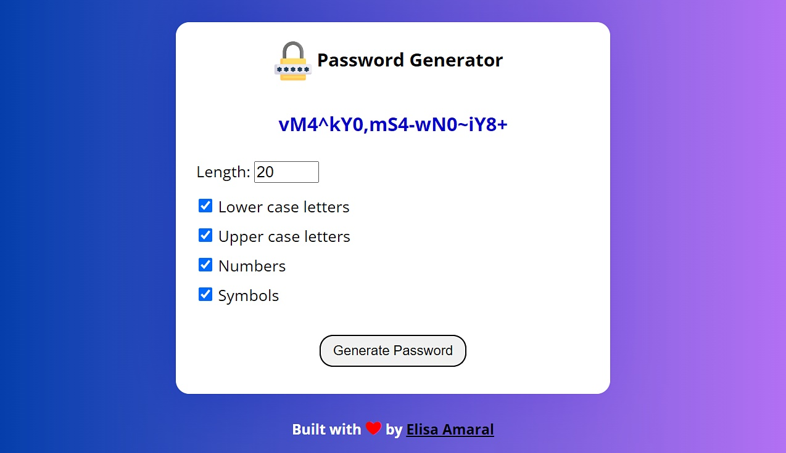

# Password Generator built with JavaScript + Webpack

This project is a password generator that generates passwords with up to 20 characters. The user can choose to add lower case letters, upper case letters, numbers and symbols to each password. 

Webpack was used to implement JavaScript module bundling.

Node.js modules (*node_modules* directory) were added to _.gitignore_

## Project Website

https://elisa-amaral.github.io/Password-Generator-built-with-JavaScript-Webpack/

## Screenshot

## Technology Stack

+ JavaScript
+ Webpack (module bundler)
+ HTML
+ CSS
